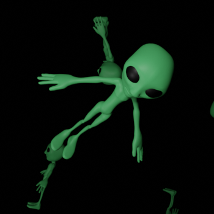

# BlendGen
Generate image data from blender models.

## Install

```
git clone https://github.com/mattiasJohnson/BlendGen.git
```

```
cd BlendGen
```

```
python -m pip install --editable .
```


## How to run

Example:
```
blendgen
```

With flags:
```
blendgen --prop-path=. --save-path=. --save-name=test_name --n-images=1 --n-instances=1
```


## How to use package modules inside Blenders scripting space

#### Install blendgen in Blenders bundled Python distribution

```
[PATH TO BLENDER]/Contents/Resources/2.93/python/bin/python3.9 -m pip install --editable [PATH TO BlendGen directory]
```
Note that the exact path to the python distribution can differ between versions of Blender.

Example use:
```
# Import blendgen
import blendgen as bg

# Reload the desired modules if you plan to make changes in the source files
import importlib
importlib.reload(bg.blender_objects)
importlib.reload(bg.utils)

# Use the blendgen functions and classes
bg.newScene()
camera = bg.Camera("my_camera")
```


## Example renders

